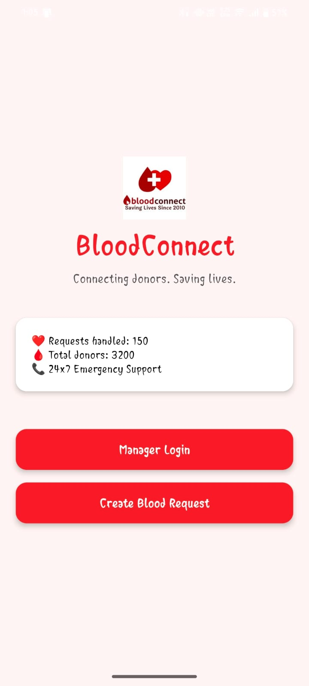
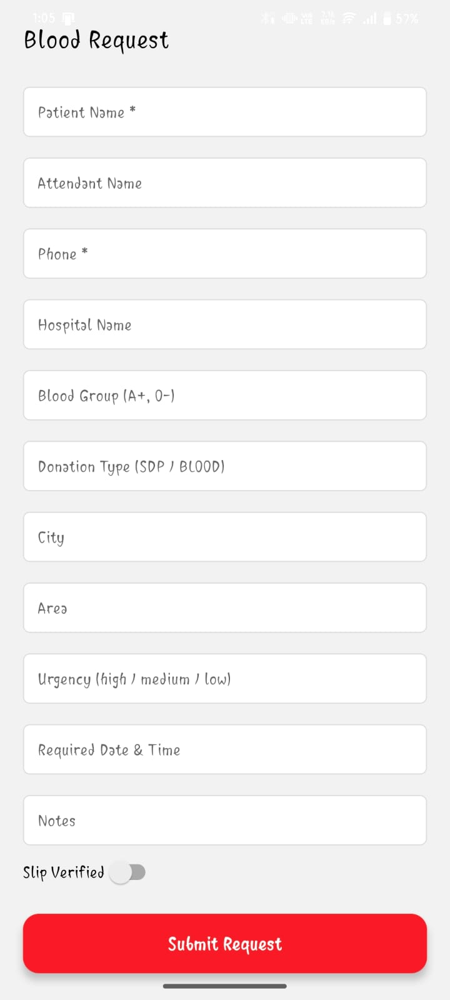
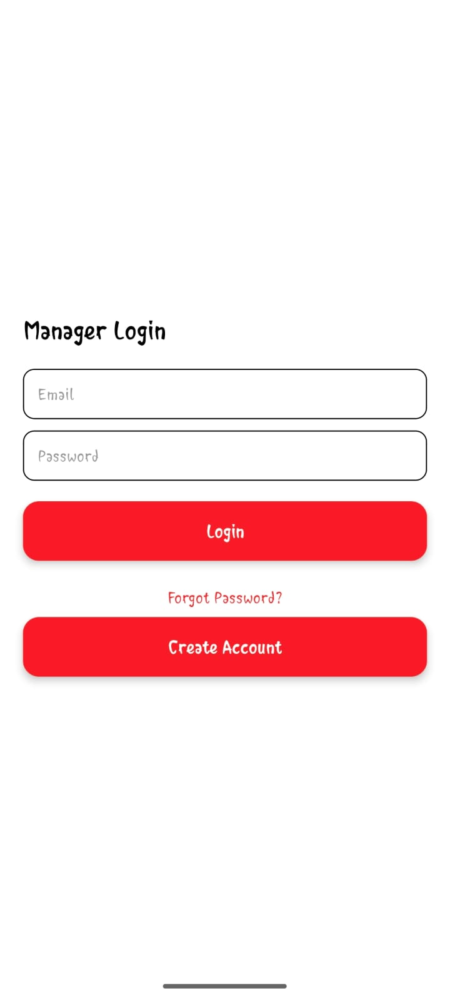
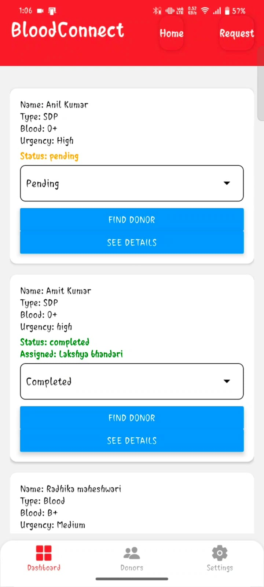
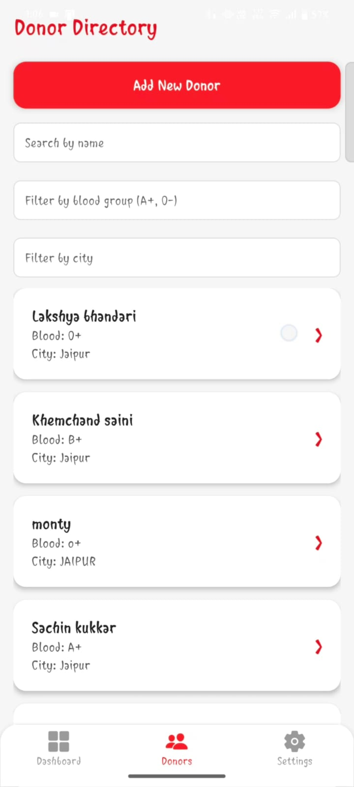
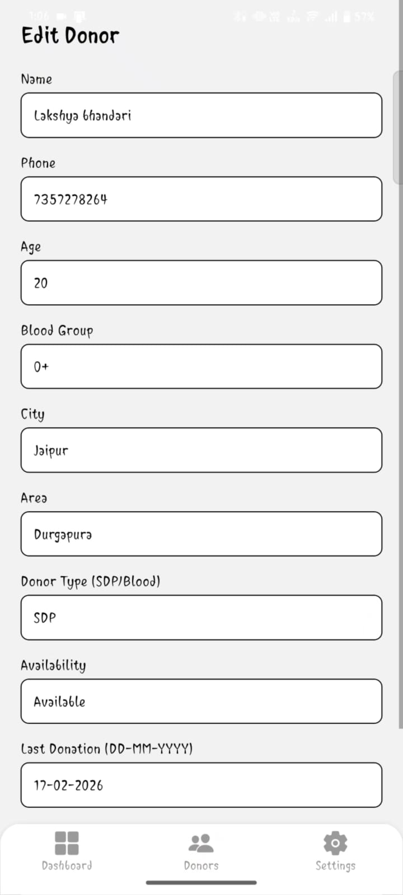

# 🩸 BloodConnect Helpline Manager

## 🚀 Overview

BloodConnect Helpline Manager is an application designed to efficiently handle blood donation requests and connect them with suitable donors.

It helps volunteers and coordinators manage requests, filter donors, and respond quickly in critical situations.

---

## 🎯 Problem Statement

Handling blood requests manually leads to:

* Delays in response
* Inefficient donor matching
* Poor tracking of requests

In emergency situations, time is critical — manual systems are not reliable.

---

## 💡 Solution

This system streamlines the helpline process by:

* Managing requests in an organized way
* Filtering donors based on key parameters
* Enabling faster and more efficient response

---

## ✨ Features

* 📞 Manage blood requests
* 🔍 Filter donors based on:

  * Blood group
  * Location
  * Availability
* ⚡ Quick donor matching
* 📋 Structured request tracking
* 🎯 Designed for real-world BloodConnect usage

---

## 🎥 Demo, APK & Pitch

📽 **Demo Video, Elevator Pitch & Pitch Deck:**
👉 https://drive.google.com/file/d/1OM5zqiLVeLnRbQ8kCNXx0zKalJxsegDc/view?usp=drivesdk

📱 **APK Download:**
👉 https://drive.google.com/file/d/1OM5zqiLVeLnRbQ8kCNXx0zKalJxsegDc/view?usp=drivesdk

> ⚠️ Enable "Install from unknown sources" on your Android device.

---

## 🔐 Demo Login Credentials

```text
Email: admin@gmail.com
Password: admin@123
```

---

## 🛠 Tech Stack

* TypeScript
* React Native
* Firestore Firebase 
* Firestore Authentication

---

## ⚙️ Setup Instructions

### 🔹 Clone the Repository

```bash
git clone https://github.com/pip-lakshya/Helpline_manager.git
```

### 🔹 Install Dependencies

```bash
npm install
```

### 🔹 Run the App

```bash
npm start
```

---

## 🏆 Hackathon / Event

This project was developed as part of **CodeRed Appathon organized by IIT Delhi**.

---

## 👨‍💻 Author

**Lakshya Bhandari**

---

## 🚀 Future Improvements

* Role-based access system
* Real-time notifications
* Location-based donor matching
* AI-based donor recommendations

---

## 📌 Note

This project is built for real-world usage in managing blood donation helpline operations.

---

## 📸 Screenshots

 
 
 